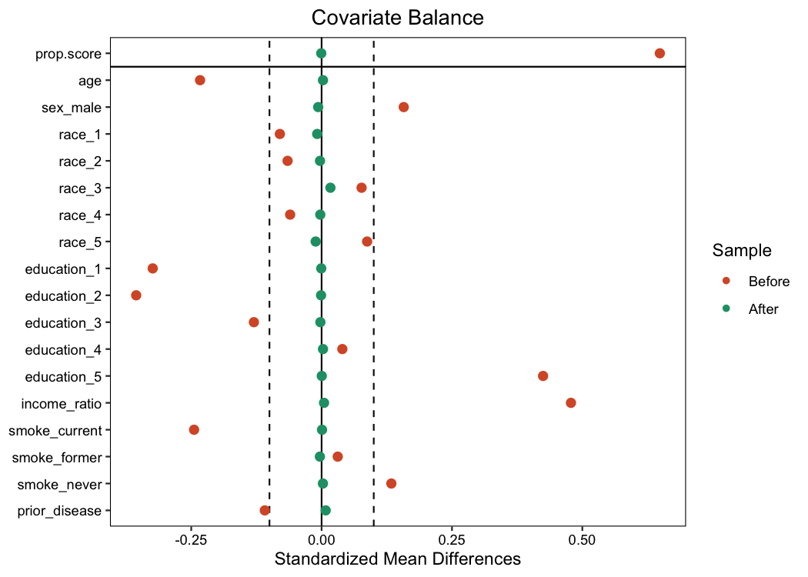

# Does Meeting the Aerobic Activity Guideline Lower Mortality

> A two-act NHANES study on predicting an outcome and then changing it.

Six cycles of NHANES (2007-2018) linked to mortality records through 2019, used to ask two
separate questions. Act 1 predicts who dies from baseline traits. Act 2 estimates whether meeting
the aerobic activity guideline actually lowers five-year mortality, separating the effect of
activity from the many ways active people already differ from inactive people.

Meeting the guideline is associated with a 3.3 percentage point lower five-year mortality risk
(weighted ATT -0.0329, 95% CI -0.041 to -0.025). The estimate holds across matching and weighting,
survives a positive control, a negative control, a reverse-causation washout, and a mediator check,
and carries an E-value of 2.9. It is reported as an upper bound on the benefit rather than a clean
causal number, since the washout shows reverse causation explains about a third of it.



## Summary

- **Question.** Whether adults age 40 and older who meet the aerobic activity guideline die at a
  lower rate than those who do not, and how much of any gap is the activity itself rather than the
  health that comes before it.
- **Data.** Six NHANES cycles, 59,842 participants, narrowing to a study cohort of 22,235 adults
  age 40 and older with mortality follow-up and a known activity level. Exposure is leisure-time
  aerobic activity in moderate-equivalent minutes per week, with 150 as the guideline threshold.
- **Act 1, prediction.** A random survival forest on each person's real follow-up rather than a
  censored five-year label. Time-dependent AUROC of 0.811 at five years and an out-of-bag
  concordance of 0.799. Body mass index is a predictor here and is dropped from the causal side.
- **Act 2, the effect.** Propensity-score matching and inverse-probability weighting, both reading
  the risk difference off a weighted survival curve so shorter follow-up is kept rather than
  discarded. Matching gives -0.0352, weighting gives -0.0329. Body mass index is left out as a
  mediator on this side.
- **Validation.** A smoking positive control recovers a known harm (0.0202). An accidental-death
  negative control sits on zero (-0.0005, interval -0.0018 to 0.0008). A two-year washout moves the
  estimate from -0.0329 to -0.0219. A mediator check adding body mass index back moves it only to
  -0.0312. An E-value of 2.93 says a confounder would need a moderate association with both activity
  and mortality to erase the result.
- **Reproducibility.** The cohort is built twice, once in R and once in DuckDB from a set of SQL
  files, and the two agree on every count, which guards against a quiet error in either path.

## Quick look

To see the results without running anything.

- **[report.html](report.html)** is the full rendered report with every figure, table, and the
  reasoning behind each check. Self-contained, open it in any browser.
- **`tables/`** holds every CSV the report reads, one per analysis.
- **`figures/`** holds the calibration, importance, balance, and distribution plots.

## Setup

Tested on macOS (Apple Silicon) and Linux. R 4.4 or newer.

```r
install.packages(c(
  "here", "dplyr", "ggplot2", "tidyr", "readr", "purrr", "haven",
  "survival", "MatchIt", "WeightIt", "cobalt", "tableone",
  "rsample", "recipes", "ranger", "timeROC",
  "DBI", "duckdb", "knitr"
))
```

Open the project through `Casual Inf.Rproj` so the working directory and the `here()` anchor are
set together. Running scripts from a bare session in another folder will misplace the outputs.

## Data

Everything is pulled and cached automatically on the first run. `data_sources.R` downloads the
NHANES survey tables from the CDC and the public-use linked mortality files, then caches them to
`data/raw` so later runs and crash recovery skip the network. Nothing needs to be downloaded by
hand. The `data/` tree is not tracked by git.

## Reproducing from scratch

Run from the project root in order. Each script reads the cached frame, so once the cohort is built
the Act 2 scripts can run in any order.

```r
source(here::here("R", "data_sources.R"))   # pull NHANES and mortality, cache to data/raw
source(here::here("R", "cohort.R"))         # derive the analysis frame
source(here::here("R", "database.R"))       # build the same cohort in DuckDB and check the counts
source(here::here("R", "eda.R"))            # cohort flow, missingness, Table 1, distribution

source(here::here("R", "prediction.R"))         # Act 1, train the survival forest
source(here::here("R", "prediction_eval.R"))    # Act 1, discrimination and calibration

source(here::here("R", "matching.R"))           # Act 2, matched estimate
source(here::here("R", "weighting.R"))          # Act 2, weighted estimate with bootstrap interval
source(here::here("R", "horizon.R"))            # five and ten-year risk differences
source(here::here("R", "positive_control.R"))   # smoking, a known harm
source(here::here("R", "negative_control.R"))   # accidental death, should be null
source(here::here("R", "washout.R"))            # reverse-causation check
source(here::here("R", "mediator.R"))           # body mass index sensitivity
source(here::here("R", "evalue.R"))             # unmeasured-confounding bound
```

Then render the report.

```
quarto render report.qmd
```

Outputs land in `figures/` and `tables/`, and the report reads from both.

## Project layout

```
.
├── Casual Inf.Rproj
├── report.qmd                 # the report source
├── report.html                # rendered, self-contained
├── R/
│   ├── paths.R                # project directories, anchored by here()
│   ├── shared.R               # cohort rule, adjustment sets, weights, estimator, bootstrap
│   ├── data_sources.R         # NHANES and mortality pulls, cached
│   ├── cohort.R               # derive the analysis frame in R
│   ├── database.R             # build the same cohort in DuckDB, check counts
│   ├── eda.R                  # cohort flow, missingness, Table 1, distribution
│   ├── prediction.R           # Act 1 training
│   ├── prediction_eval.R      # Act 1 scoring
│   ├── matching.R             # Act 2 matched estimate
│   ├── weighting.R            # Act 2 weighted estimate
│   ├── horizon.R              # five and ten-year horizons
│   ├── positive_control.R     # smoking control
│   ├── negative_control.R     # accidental-death control
│   ├── washout.R              # reverse-causation washout
│   ├── mediator.R             # body mass index sensitivity
│   └── evalue.R               # E-value
├── SQL/                       # DuckDB build, one file per derived table
├── data/{raw,interim,processed}/   # not tracked by git
├── figures/                   # rendered plots
└── tables/                    # rendered CSVs and Table 1
```

## Citation

```
@misc{keith2026activity,
  author       = {Keith, Arlene},
  title        = {Does Meeting the Aerobic Activity Guideline Lower Mortality},
  year         = {2026},
  howpublished = {NHANES observational study},
  url          = {https://github.com/jsf3467v/causal-inference-nhanes}
}
```

## License

MIT License, see `LICENSE`.
