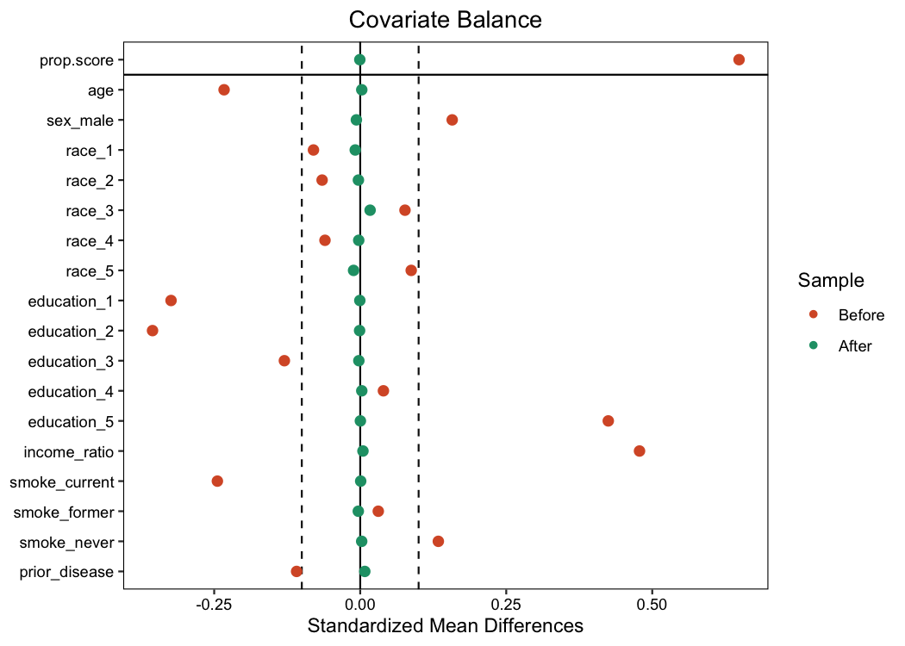

# Does Meeting the Aerobic Activity Guideline Lower Mortality?

This project asks whether meeting the aerobic activity guideline lowers the risk of death, and it answers the question in two acts. The first act is one of prediction. It measures how well a person's baseline characteristics forecast death within five years and goes no further. The second act addresses the harder question of whether activity itself lowers that risk, which requires separating the effect of the activity from the many ways in which active and inactive adults already differ at baseline. Prediction and causation are distinct claims, and distinguishing between them is the purpose of the study.

The data comprise six cycles of NHANES ($2007$-$2018$), linked to mortality records through $2019$. Adults aged $40$ and older who were eligible for follow-up and had a known activity level form the study cohort of $22{,}235$ people. Activity is measured as leisure-time aerobic minutes per week, and $150$ minutes marks the guideline threshold.

Meeting the guideline corresponds to a $3.3$ percentage point reduction in five-year mortality risk, a weighted average treatment effect on the treated of $-0.0329$, with a $95$ percent confidence interval from $-0.041$ to $-0.025$. The estimate holds under both matching and weighting, and it survives the positive and negative controls, a reverse-causation washout, and a mediator check. An E-value of 2.9measures its resilience further, since an unmeasured confounder would need an association of at least that strength with both activity and mortality to account for the result. The washout is also where the main caution appears, because dropping deaths in the first two years removes roughly a third of the effect, which points to reverse causation. For that reason, the figure is best interpreted as an upper bound on the benefit rather than a settled causal estimate. Since the washout indicates that roughly a third of the effect may reflect reverse causation.




## Summary

- **Question.** Whether adults aged 40 and older who meet the aerobic activity guideline have a
lower death rate compared to those who do not, and to what extent this difference is due to the
activity itself versus their prior health.


- **Data.** Six NHANES cycles included 59,842 participants, which was narrowed down to a study cohort of 22,235 adults aged 40 and older. This group was followed for mortality and had known activity levels. Exposure was measured as leisure-time aerobic activity in moderate-equivalent minutes per week, using 150 minutes as the guideline threshold.


- **Act 1, prediction.** A random survival forest is applied to each individual's actual follow-up data instead of a censored five-year label. The model achieves a time-dependent area under the receiver operating characteristic curve of $0.811$ at five years and an out-of-bag concordance of $0.799$. Body mass index is used as a predictor in this context but is removed from the causal analysis.


- **Act 2, the effect.** Propensity-score matching and inverse-probability weighting each read the risk difference from a weighted survival curve, which keeps participants with shorter follow-up rather than discarding them. The two approaches agree closely, matching at $-0.0352$ and weighting at $-0.0329$, and body mass index is left out of the adjustment because it sits on the pathway from activity to death rather than confounding it.


- **Validation.** A smoking positive control recovers a known harm, $0.0202$. An accidental-death
  negative control sits on zero, $-0.0005$ with an interval from $-0.0018$ to $0.0008$. A two-year
  washout moves the estimate from $-0.0329$ to $-0.0219$. A mediator check adding body mass index
  back moves it only to $-0.0312$. An E-value of $2.93$ says a confounder would need a moderate
  association with both activity and mortality to erase the result.


- **Reproducibility.** The cohort is built twice, once in R and once in DuckDB from a set of SQL
  files, and the two agree on every count, which guards against a quiet error in either path.

## Overview

To see the results without running anything.

- **[report.html](report.html)** is the full rendered report with every figure, table, and the
  reasoning behind each check. Self-contained, open it in any browser.
- **`tables/`** holds every comma-separated table the report reads, one per analysis.
- **`figures/`** holds the receiver operating characteristic, calibration, importance, balance, and
  distribution plots.
- **`dashboard/`** holds a single flat export, `cohort_descriptive.csv`, that feeds a
  [Tableau Public dashboard](https://public.tableau.com/app/profile/a.keith/viz/ActivityandMortalityChart/Dashboard1)
  showing the unadjusted patterns in the cohort. The adjusted causal analysis lives in the report.

## Setup

Tested on macOS (Apple Silicon) and Linux. R 4.4 or newer.

```r
install.packages(c(
  "here", "dplyr", "ggplot2", "tidyr", "readr", "purrr", "haven",
  "survival", "MatchIt", "WeightIt", "cobalt", "tableone",
  "rsample", "recipes", "ranger", "timeROC",
  "DBI", "duckdb", "knitr"
))
```

Open the project through `Causal Inf.Rproj` so the working directory and the `here()` anchor are
set together. Running scripts from a bare session in another folder will misplace the outputs.

## Data

Everything is pulled and cached automatically on the first run. `data_sources.R` downloads the
NHANES survey tables from the Centers for Disease Control and Prevention and the public-use linked
mortality files, then caches them to `data/raw` so later runs and crash recovery skip the network.
Nothing needs to be downloaded by hand. The `data/` tree is not tracked by git.

## Reproducing from scratch

Run from the project root in order. Each script reads the cached frame, so once the cohort is built the Act 2 scripts can run in any order.

```r
source(here::here("R", "data_sources.R"))   # pull NHANES and mortality, cache to data/raw
source(here::here("R", "cohort.R"))         # derive the analysis frame
source(here::here("R", "database.R"))       # build the same cohort in DuckDB and check the counts
source(here::here("R", "eda.R"))            # cohort flow, missingness, Table 1, distribution
source(here::here("R", "dashboard.R"))      # descriptive export for the Tableau dashboard

source(here::here("R", "prediction.R"))         # Act 1, train the survival forest
source(here::here("R", "prediction_eval.R"))    # Act 1, discrimination and calibration

source(here::here("R", "matching.R"))           # Act 2, matched estimate
source(here::here("R", "weighting.R"))          # Act 2, weighted estimate with bootstrap interval
source(here::here("R", "horizon.R"))            # five and ten-year risk differences
source(here::here("R", "positive_control.R"))   # smoking, a known harm
source(here::here("R", "negative_control.R"))   # accidental death, should be null
source(here::here("R", "washout.R"))            # reverse-causation check
source(here::here("R", "mediator.R"))           # body mass index sensitivity
source(here::here("R", "evalue.R"))             # unmeasured-confounding bound
```

Then render the report.

```
quarto render report.qmd
```

Outputs land in `figures/` and `tables/`, and the report reads from both.

## Project layout

```
.
├── Causal Inf.Rproj
├── LICENSE
├── README.md
├── report.qmd                 # the report source
├── report.html                # rendered, self-contained
├── .github/
│   └── workflows/
│       └── ci.yml             # runs the test suite on every push
├── R/
│   ├── paths.R                # project directories, anchored by here()
│   ├── shared.R               # cohort rule, adjustment sets, weights, estimator, bootstrap
│   ├── data_sources.R         # NHANES and mortality pulls, cached
│   ├── cohort.R               # derive the analysis frame in R
│   ├── database.R             # build the same cohort in DuckDB, check counts
│   ├── eda.R                  # cohort flow, missingness, Table 1, distribution
│   ├── dashboard.R            # descriptive export for the Tableau dashboard
│   ├── prediction.R           # Act 1 training
│   ├── prediction_eval.R      # Act 1 scoring
│   ├── matching.R             # Act 2 matched estimate
│   ├── weighting.R            # Act 2 weighted estimate
│   ├── horizon.R              # five and ten-year horizons
│   ├── positive_control.R     # smoking control
│   ├── negative_control.R     # accidental-death control
│   ├── washout.R              # reverse-causation washout
│   ├── mediator.R             # body mass index sensitivity
│   └── evalue.R               # E-value
├── SQL/                       # DuckDB build, one file per derived table
├── tests/
│   ├── test_shared.r          # unit tests for the shared building blocks
│   └── test_outputs.r         # checks on the committed result tables
├── dashboard/                 # descriptive export for Tableau
├── data/{raw,interim,processed}/   # not tracked by git
├── figures/                   # rendered plots
└── tables/                    # rendered tables and Table 1
```

## Citation

```
@misc{keith2026activity,
  author       = {Keith, Arlene},
  title        = {Does Meeting the Aerobic Activity Guideline Lower Mortality},
  year         = {2026},
  howpublished = {NHANES observational study},
  url          = {https://github.com/jsf3467v/causal-inference-nhanes}
}
```

## License

MIT License, see `LICENSE`.
